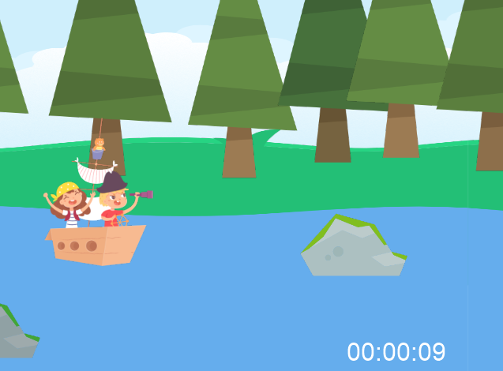

# Back to School

Made for Global Game Jam Temuco Chile 2022.
Two kids have to sail their way to school as soon as possible traveling 
through the forest. The map is procedurally generated so the chances you 
would play the same game are negligible.

## Usage

To install requirements run:

`$ python -m pip install requirements.txt`

To play the game run:

`$ python main.py`

Alternatively, you can download an executable version for Windows from the 
"releases" section of this repository. Once you download it look at the
README.txt file for instructions on how to use that version.

## Controls

- Use **[UP]** and **[DOWN]** arrows to change lane
- Press **[SPACE]** to move forward
- Press **[ESC]** to quit
- Press **[ENTER]** or **[RETURN]** to pause or unpause

## Objective

Travel to the end as soon as possible avoiding the obstacles.

## Credits

Made using Python with pyglet by Jesús Henríquez. Assets by Pedro Alarcón.
Sounds and music from freesound.org.

Music "acustic guitar duet" by _graham_makes_.

Background sounds by _CosmicEmbers_.

Paddle sound by _EpicWizard_.

Hit sound by _gristi_.
